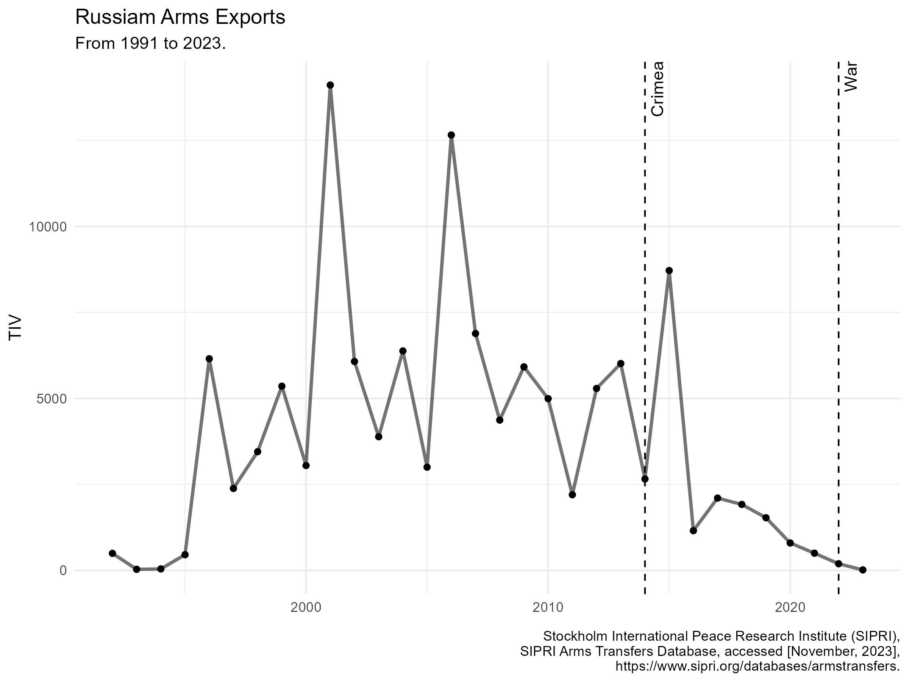
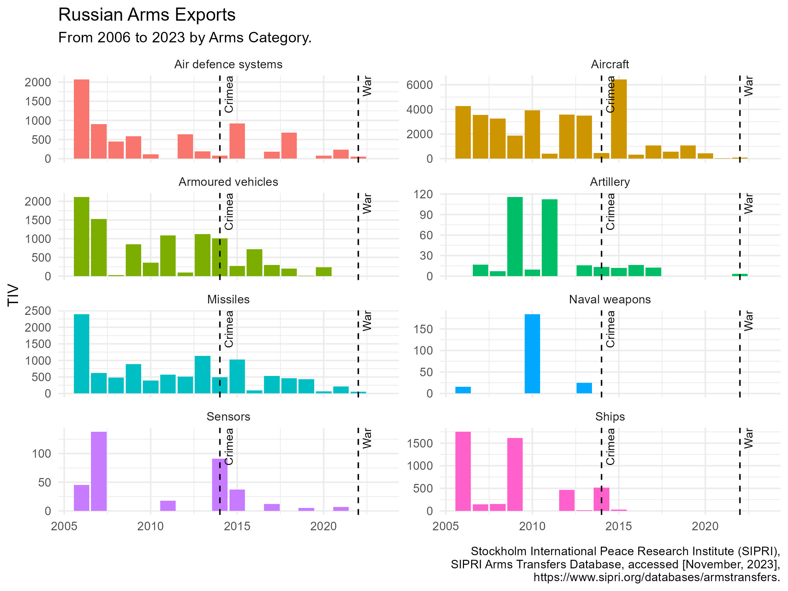
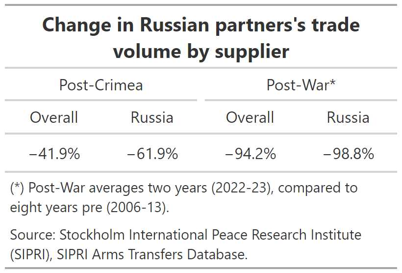
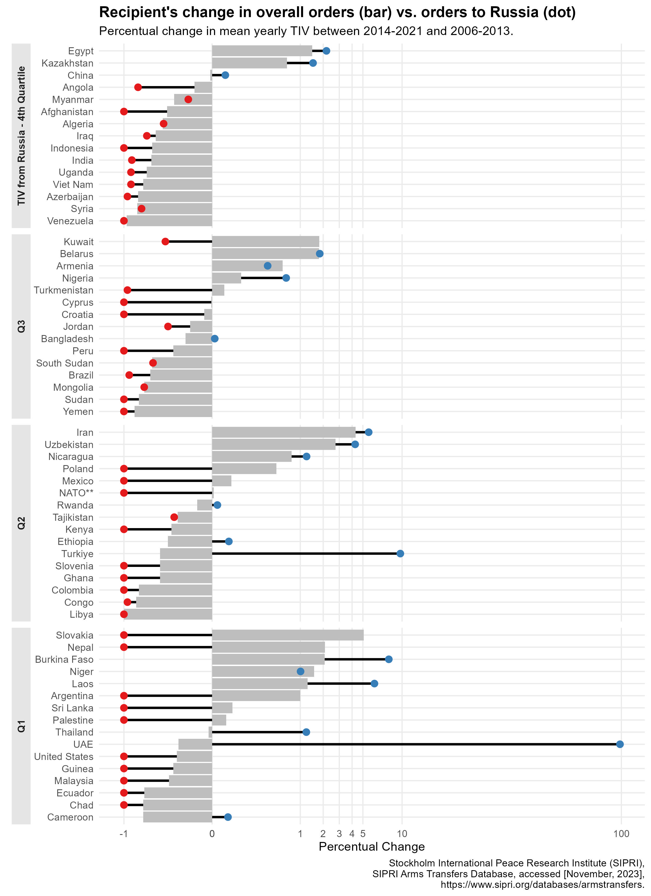

# The Collapse of Russian Arms Exports

## Context
Since April 2022, Russia has prohibited the publication of its import-export statistics. Among the most sensitive data, its arms production and exports remain of strategic importance for nations on both sides of the conflict. 

Open source information suggests that it has slowly but steadily ramped production capacity through the expansion of manufacturing plants and deepening alliances that guarantee deliveries of munitions and manpower. Western sanctions failed to weaken its war machine and stop the aggression. 

This success story can’t be told by the Russian arms exports industry.  Since Crimea’s invasion in early 2014, long-term strategic partners have nearly ceased placing new orders as buyers see Russian equipment burning and question its capacity to honour deliveries in the following years. From 2022, as Russia waged its full-scale war in Ukraine, exports begin to cease entirely.

**This project utilises the Stockholm International Peace Research Institute (SIPRI) database to answer:**

- How does Russian arms exports pre-Crimea, post-Crimea and post-Full war compare?
- Which Russian partners are responsible for its decline?
- Which countries are filling the gap left by Russian arms?

## Takeaways

1. The yearly average TIV procured by Russian partners' shrinked by 42% in the period post-Crimea invasion. Their orders to Russia were down by 62%.
2. Out of 62 countries supplied between 2006-2013, 43 (69%) reduced orders to Russia after 2014, of which 26 ceased it entirely. After the full scale war, only Algeria, Belarus, Iran, Kazakhstan and Tajikistan remained.
3. Approximately 80% of Russia’s post-Crimea trade loss comes from India (-13,978 TIV), Viet Nam (-4544), Algeria (-3926), Venezuela (-3698) and Azerbaijan (-2020).
4. Aircrafts, Air Defence Systems, Armoured Vehicles, Missiles and Ships are historically the leading categories exported by Russia.  Major Russian partners turned to western-allied countries. The main transactions regard:
   - French and American aircrafts;
   - Israeli, British and French missiles;
   - South-Korean and British artillery systems;
   - German armoured vehicles; and
   - South-Korean, Dutch and American ships.

5. France (+835 TIV) and South Korea (+554) are the big winners in this shifting market. Despite the overall decline in the conventional weapons trade to Russian-aligned nations, they increased exports by sizable measures post-Crimea invasion. For reference, the United States (-1254), China (-1108) and the United Kingdom (--694) registered negative change in the same period.

# Russian Arms Exports Trends

- Russia has maintained a tighter trading partners group than other major arms suppliers. Since 2006,  India (23%), Algeria (15%) and China (14%) represent nearly half of all TIV transferred, followed by Viet Nam (7%), Egypt (6%) and Venezuela (5%). 

- Trade volume was  relatively stable between 2006 and 2013, averaging 6358 TIV per year.  From 2016, new orders volume declined to an all-time low.

- After 2014, a single spike in transfers happened in 2015, when China (4342 TIV) and Egypt (3141 TIV) placed orders for combat aircrafts.

  

# Exports decline per category

- Aircrafts, Air Defence Systems, Armoured Vehicles, Missiles and Ships are historically the leading categories exported by Russia.

- Air Defence Systems, Armoured Vehicles and Missiles were the most resilient categories, extending sales until 2022 despite reduced volume compared to the previous period.

- Aircraft had the most significant decline. These items have one the highest TIV values and were also the main export category for Russia. While their trade extended until 2020, the yearly volume was a third of the previous period due to two large orders in 2015.

- Ships and Naval Weapons exports ceased entirely after 2015.

  

# Items that sustained exports after 2014

- Links to the tables with details of the items exported by category are available below:
   - [Air Defence Systems](https://github.com/lucacasu/Global-Arms-Trade/blob/main/russia_trade_decline/table_russia_trade_decline/table_exports_russia_air_defence_systems.png)
   - [Aircrafts](https://github.com/lucacasu/Global-Arms-Trade/blob/main/russia_trade_decline/table_russia_trade_decline/table_exports_russia_aircraft.png)
   - [Armoured Vehicles](https://github.com/lucacasu/Global-Arms-Trade/blob/main/russia_trade_decline/table_russia_trade_decline/table_exports_russia_armoured_vehicles.png)
   - [Missiles](https://github.com/lucacasu/Global-Arms-Trade/blob/main/russia_trade_decline/table_russia_trade_decline/table_exports_russia_missiles.png)
   - [Ships](https://github.com/lucacasu/Global-Arms-Trade/blob/main/russia_trade_decline/table_russia_trade_decline/table_exports_russia_ships.png)

- A handful of items were the lifeline for Russian exports after 2014. Orders were concentrated in fewer items than the previous period as many sub-categories did not register new transfers.

  - **Air Defence Systems / Missiles**

    - The medium-range Pechora-2M was the main SAM system pre-Crimea, but registered no sales after 2014. Instead, Russia exported variants of the long-range S400 and S300 short-range Tor-M systems. 

    - BVRAAM and Anti-tank missiles sustained most of the trade volume in the Missiles category after 2014. Anti-ship and Portable SAM missiles registered no sales after 2014.

  - **FGA Aircrafts and Helicopters**

    - Newer variants of the Sukhoi and MiG fighters sustained the aircraft category, despite registering fewer transfers than their predecessors.

    - After 2013, Mi-28N, the main combat helicopter between 2006-2013, accounted for mere 5% of the transfers pre-Crimea. The category was sustained by the newer Ka-52 Alligator while other Mi variants registered slightly lower volumes.

    - The Mi-17 transport helicopter had ~80% less transfers after 2014.

  - **Armoured Vehicles**

    - Among the BMP variants, the BMP-2 was the only to register a higher volume after 2014, despite the BMP-1 dropping more than 80%.

    - The more capable (and expensive) T-90S lost approximately 75% of its transfer volume, but continued to be the main battle tank exported. Variants T-72B and T72-B3 registered nearly twice the T-72 volume pre-Crimea.

# Changes in overall orders and orders to Russia

  

 
 

The following chart displays the percentage change in TIV ordered (bar) by Russian partners between 2014-2021, compared to 2006-2013. The dots are the percentage change of orders to Russia.  Countries are grouped in quartiles of order volume to Russia.

- While most countries have reduced their overall orders (41), Russia’s main clients (Q4, Q3) are the most affected by budget cuts. An even larger number of clients cut orders to Russia (43). In general, those who cut overall orders also cut orders to Russia in greater measure.

- A few notable exceptions in Q1 and Q2 regard negligible TIV values:

- The UAE ordered 0.25 TIV from Russia in the pre-Crimea period, increasing it to 25 TIV post--Crimea. Its overall orders amounted to 592 TIV between 2014-2021.

- Burkina Faso, Laos and Thailand orders are decimals or single-digit figures in both periods.

- While Turkey ordered only 42 TIV from Russia post-Crimea, it represents a ten-fold from the previous period and a significant increase of market share as overall orders were less than half (187 TIV) as between 2006 and 2013 (453 TIV).

- Approximately 80% of Russia’s post-Crimea trade loss comes from India (-13,978 TIV), Viet Nam (-4544), Algeria (-3926), Venezuela (-3698) and Azerbaijan (-2020). The orders from these five nations are detailed in the next section’s tables.

  

# Suppliers filling the market gap. [Work-in-progress]

- The gap left by the decline in Russia’s exports among the top five buyers in the pre-Crimea period was mainly filled by Western-allied countries

   - France, Israel, South Korea, Germany and the United Kingdom and United States.

- Links to the tables with details of the items ordered are available below:

   - [India](https://github.com/lucacasu/Global-Arms-Trade/blob/main/russia_trade_decline/table_buyers_trade_change/table_exports_winners_India.png)

   - [Algeria](https://github.com/lucacasu/Global-Arms-Trade/blob/main/russia_trade_decline/table_buyers_trade_change/table_exports_winners_Algeria.png)

   - [Viet Nam](https://github.com/lucacasu/Global-Arms-Trade/blob/main/russia_trade_decline/table_buyers_trade_change/table_exports_winners_Viet_Nam.png)

   - [Azerbaijan](https://github.com/lucacasu/Global-Arms-Trade/blob/main/russia_trade_decline/table_buyers_trade_change/table_exports_winners_Azerbaijan.png)

   - [Venezuela](https://github.com/lucacasu/Global-Arms-Trade/blob/main/russia_trade_decline/table_buyers_trade_change/table_exports_winners_Venezuela.png)

.

